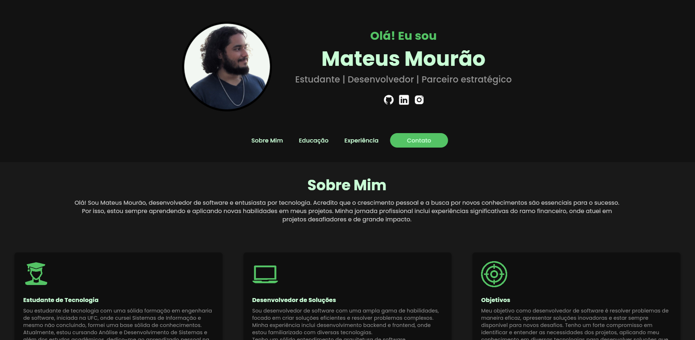

# Meu Portfólio em Flutter

Este é o código-fonte do meu portfólio pessoal desenvolvido com Flutter. Ele foi projetado para mostrar meus projetos, habilidades e experiências de maneira profissional e visualmente atraente.

## Demonstração



## Funcionalidades

- Exibição de projetos com detalhes e links.
- Design responsivo.

## Tecnologias Utilizadas

- [Flutter](https://flutter.dev/) - Framework para desenvolvimento multiplataforma.
- [Dart](https://dart.dev/) - Linguagem de programação utilizada no Flutter.


## Pré-requisitos

Certifique-se de ter o seguinte instalado na sua máquina:

- [Flutter](https://flutter.dev/docs/get-started/install) (versão 3.0 ou superior)
- [Dart](https://dart.dev/get-dart)
- Um editor de código (recomendo [Visual Studio Code](https://code.visualstudio.com/) ou [Android Studio](https://developer.android.com/studio))

## Como Rodar o Projeto

Siga os passos abaixo para rodar o projeto em sua máquina local:

1. **Clone o Repositório:**

   ```bash
   git clone https://github.com/seu-usuario/seu-repositorio.git
   cd seu-repositorio

2. **Instale as Dependências:**

    Navegue até o diretório do projeto e execute o comando abaixo para instalar as dependências:

    ```bash
    flutter pub get

3. **Execute o Projeto:**

    Para rodar o projeto em um emulador ou dispositivo físico, use o comando:

    ```bash
    flutter run

## Licença
Este projeto está licenciado sob os termos da licença MIT. Veja o arquivo LICENSE para mais detalhes.
